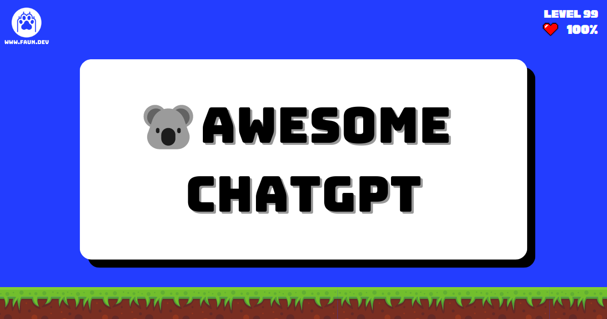

# Brought To You By:
❤️ [Kala: AI/ML Weekly Newsletter](https://faun.dev/newsletter/kala) - Curated AI/ML news, tutorials, tools, jobs and more!.

# Follow & Share

# Call for Contributions
👋 We value your contributions, feedback and suggestions. Please feel free to create a pull request or open an issue.

# Table of Contents

- [Brought To You By:](#brought-to-you-by)
- [Follow \& Share](#follow--share)
- [Call](#call)
- [Table of Contents](#table-of-contents)
- [Awesome ChatGPT:](#awesome-chatgpt)
  - [Official Resources](#official-resources)
  - [Developer Libraries, SDKs, and APIs](#developer-libraries-sdks-and-apis)
    - [Python](#python)
    - [JavaScript](#javascript)
    - [Golang](#golang)
    - [Rust](#rust)
    - [TypeScript](#typescript)
    - [Kotlin](#kotlin)
  - [Browser Extensions](#browser-extensions)
    - [Chrome](#chrome)
    - [Firefox](#firefox)
  - [Integrations](#integrations)
    - [Terminal](#terminal)
    - [NeoVim](#neovim)
    - [WhatsApp](#whatsapp)
    - [Telegram](#telegram)
    - [Slack](#slack)
    - [Discord](#discord)
    - [VSCode](#vscode)
    - [Google Docs](#google-docs)
    - [JetBrains IDE](#jetbrains-ide)
    - [Wordpress](#wordpress)
    - [Raycast](#raycast)
    - [WeChat](#wechat)
    - [Prompts](#prompts)
  - [AI Assistants](#ai-assistants)
  - [Desktop Apps](#desktop-apps)
  - [Twitter Bots](#twitter-bots)

# Awesome ChatGPT: 

A curated list of awesome ChatGPT resources, libraries, SDKs, APIs, and more.

## Official Resources

- [ChatGPT app](https://chat.openai.com/)
- [ChatGPT overview](https://openai.com/blog/chatgpt/)
- [ChatGTP Discord](https://discord.com/invite/openai)

## Developer Libraries, SDKs, and APIs

### Python

- [ChatGPT](https://github.com/acheong08/ChatGPT): Lightweight package for interacting with ChatGPT's API by OpenAI. Uses reverse engineered official API
- [PyChatGPT](https://github.com/rawandahmad698/PyChatGPT): zap Python client for the unofficial ChatGPT API with auto token regeneration, conversation tracking, proxy support and more.
- [chatgpt-api](https://github.com/taranjeet/chatgpt-api): This repo is unofficial ChatGPT api. It is based on Daniel Gross's WhatsApp GPT
- [chatgpt-wrapper](https://github.com/mmabrouk/chatgpt-wrapper): API for interacting with ChatGPT using Python and from Shell.
- [chatGPT-discord-bot](https://github.com/Zero6992/chatGPT-discord-bot): Integrate ChatGPT into your own discord bot
- [chatgpt-python](https://github.com/labteral/chatgpt-python): Unofficial Python SDK for OpenAI's ChatGPT
- [TextRL](https://github.com/voidful/TextRL): Reinforcement learning in text generation with transformers - Implementation of ChatGPT RLHF (Reinforcement Learning with Human Feedback)
- [stackexplain](https://github.com/shobrook/stackexplain): Explain your error message with ChatGPT
- [gtp3-wordpress-post-generator](https://github.com/nicolaballotta/gtp3-wordpress-post-generator): A simple cli to generate WordPress posts using Gpt3 starting from a topic.
- [emailGPT](https://github.com/lucasmccabe/emailGPT): a quick and easy interface to generate emails with ChatGPT
- [docGPT](https://github.com/cesarhuret/docGPT): ChatGPT directly within Google Docs as an Editor Add-on
- [chatgpt-conversation](https://github.com/platelminto/chatgpt-conversation): Have a conversation with ChatGPT using your voice, and have it talk back.
- 🇨🇳 [Openaibot](https://github.com/sudoskys/Openaibot): OpenAI Chat Bot For Telegram
- 🇨🇳 [chatgpt-mirai-qq-bot](https://github.com/lss233/chatgpt-mirai-qq-bot): OpenAI ChatGPT for Mirai QQ Bot
- 🇨🇳 [QChatGPT](https://github.com/RockChinQ/QChatGPT): QQ robot bot developed based on OpenAI ChatGPT
- 🇨🇳 [nonebot-plugin-chatgpt](https://github.com/A-kirami/nonebot-plugin-chatgpt): Smart Conversation Chat plugin for NoneBot2.
- 🇨🇳 [ChineseAiDungeonChatGPT](https://github.com/bupticybee/ChineseAiDungeonChatGPT): AI dungeon using ChatGPT as the storytelling model

### JavaScript

- [chatgpt-mac](https://github.com/vincelwt/chatgpt-mac): ChatGPT for Mac, living in your menubar.
- [chatgpt-advanced](https://github.com/qunash/chatgpt-advanced): A browser extension that augments your ChatGPT prompts with web results.
- [summarize.site](https://github.com/clmnin/summarize.site): Summarize web pages using OpenAI ChatGPT
- [ChatGPT-ProBot](https://github.com/oceanlvr/ChatGPT-ProBot): A GPTChat based GitHub robot. dialogue/CR/etc..
- [YouTube_Summary_with_ChatGPT](https://github.com/kazuki-sf/YouTube_Summary_with_ChatGPT): YouTube Summary with ChatGPT is a simple Chrome Extension (manifest v3) that allows you to get both YouTube video transcripts and summary of the video with OpenAI's ChatGPT AI technology.
- 🇨🇳 [wechat-bot](https://github.com/wangrongding/wechat-bot): a WeChat bot based on OpenAi ChatGPT + WeChaty that can be used to help you automatically reply to WeChat messages, or manage WeChat groups/friends, detect zombie fans, etc...

### Golang

- [aiac](https://github.com/gofireflyio/aiac): Artificial Intelligence Infrastructure-as-Code Generator.
- [openaigo](https://github.com/otiai10/openaigo): OpenAI (ChatGPT) API Client for Go
- [whatsapp-gpt](https://github.com/danielgross/whatsapp-gpt): WhatsApp bot that uses Golang with a multichat option (chatgpt chatting with chatgpt).
- [beelzebub](https://github.com/mariocandela/beelzebub): A secure honeypot framework low code, extremely easy to configure by yaml 
- 🇨🇳 [wechatgpt](https://github.com/houko/wechatgpt): wechat chatgpt bot

### Rust
- [chatgpt-desktop](https://github.com/sonnylazuardi/chatgpt-desktop): OpenAI ChatGPT desktop app for Mac, Windows, & Linux menubar using Tauri & Rust

### TypeScript
- [chatgpt-raycast](https://github.com/abielzulio/chatgpt-raycast): ChatGPT raycast extension
- [chatgpt-twitter-bot](https://github.com/transitive-bullshit/chatgpt-twitter-bot): Twitter bot powered by OpenAI's ChatGPT. 
- [tweetGPT](https://github.com/yaroslav-n/tweetGPT): TweetGPT is a chrome extension that generates tweets and replies using chatGPT

### Kotlin
- [chatgpt-android](https://github.com/skydoves/chatgpt-android): ChatGPT Android demonstrates OpenAI's ChatGPT on Android with Stream Chat SDK for Compose.

### Swift
- [new-man](https://github.com/weykon/new-man): New Man is a MacOS native app as a popover view for easy searching and asking.

## Browser Extensions

### Chrome

- [ChatGPT_Extension](https://github.com/kazuki-sf/ChatGPT_Extension): ChatGPT Extension is a really simple Chrome Extension (manifest v3) that you can access OpenAI's ChatGPT from anywhere on the web.
- [chat-gpt-google-extension](https://github.com/wong2/chat-gpt-google-extension): A browser extension to display ChatGPT response alongside search engine results.
- [ChatGPT-pdf](https://github.com/liady/ChatGPT-pdf): A Chrome extension for downloading your ChatGPT history to PNG, PDF or a sharable link
- [assistant-chat-gpt](https://github.com/idosal/assistant-chat-gpt): A Chrome browser extension that embeds ChatGPT as a hands-free voice assistant
- [sharegpt](https://github.com/domeccleston/sharegpt): Easily share permanent links to ChatGPT conversations with your friends
- [chatgpt-advanced](https://github.com/qunash/chatgpt-advanced): A browser extension that augments your ChatGPT prompts with web results.
- [tweetGPT](https://github.com/yaroslav-n/tweetGPT): TweetGPT is a chrome extension that generates tweets and replies using chatGPT
- [YouTube_Summary_with_ChatGPT](https://github.com/kazuki-sf/YouTube_Summary_with_ChatGPT): YouTube Summary with ChatGPT is a simple Chrome Extension (manifest v3) that allows you to get both YouTube video transcripts and summary of the video with OpenAI's ChatGPT AI technology.

### Firefox
- [chat-gpt-google-extension](https://github.com/wong2/chat-gpt-google-extension): A browser extension to display ChatGPT response alongside search engine results.

## Integrations

### Terminal
- [ai-cli](https://github.com/abhagsain/ai-cli): Get answers for CLI commands from GPT3 right from your terminal

### NeoVim
- [ChatGPT.nvim](https://github.com/jackMort/ChatGPT.nvim): Neovim plugin for interacting with OpenAI GPT-3 chatbot, providing an easy interface for exploring GPT-3 and NLP.

### WhatsApp
- [whatsapp-gpt](https://github.com/danielgross/whatsapp-gpt): WhatsApp bot that uses Golang with a multichat option (chatgpt chatting with chatgpt).
- [chatgpt-api](https://github.com/taranjeet/chatgpt-api): This repo is unofficial ChatGPT api. It is based on Daniel Gross's WhatsApp GPT

### Telegram
- [chatgpt-telegram-bot-serverless](https://github.com/franalgaba/): ChatGPT Telegram Bot running in AWS Lambda

### Slack
- [ChatGPTSlackBot](https://github.com/pedrorito/ChatGPTSlackBot): A Slack bot that integrates with OpenAI's ChatGPT to provide answers, written in Python

### Discord
- [chatgpt-discord](https://github.com/m1guelpf/chatgpt-discord): Run your own GPTChat Discord bot, with a single command!
- [chatGPT-discord-bot](https://github.com/Zero6992/chatGPT-discord-bot): Integrate ChatGPT into your own discord bot

### VSCode
- [chatgpt-vscode](https://github.com/mpociot/chatgpt-vscode): A VSCode extension that allows you to use ChatGPT

### Google Docs
- [docGPT](https://github.com/cesarhuret/docGPT): ChatGPT directly within Google Docs as an Editor Add-on

### JetBrains IDE
- [intellij-chatgpt](https://github.com/LiLittleCat/intellij-chatgpt): A ChatGPT plugin for IntelliJ Platform-Based IDEs

### Wordpress
- [gtp3-wordpress-post-generator](https://github.com/nicolaballotta/gtp3-wordpress-post-generator): A simple cli to generate WordPress posts using Gpt3 starting from a topic.

### Raycast
- [chatgpt-raycast](https://github.com/abielzulio/chatgpt-raycast): ChatGPT raycast extension

### WeChat
- 🇨🇳 [wechat-bot](https://github.com/wangrongding/wechat-bot): a WeChat bot based on OpenAi ChatGPT + WeChaty that can be used to help you automatically reply to WeChat messages, or manage WeChat groups/friends, detect zombie fans, etc...
- 🇨🇳 [wechatgpt](https://github.com/houko/wechatgpt): wechat chatgpt bot

### Prompts
- [awesome-chatgpt-prompts](https://github.com/f/awesome-chatgpt-prompts): A curated list of ChatGPT prompts
- [showgpt.co](https://showgpt.co/): Curated ChatGPT prompts

## AI Assistants
- [emailGPT](https://github.com/lucasmccabe/emailGPT): a quick and easy interface to generate emails with ChatGPT
- [summarize.site](https://github.com/clmnin/summarize.site): Summarize web pages using OpenAI ChatGPT
- [chatgpt-conversation](https://github.com/platelminto/chatgpt-conversation): Have a conversation with ChatGPT using your voice, and have it talk back.
- [assistant-chat-gpt](https://github.com/idosal/assistant-chat-gpt): A Chrome browser extension that embeds ChatGPT as a hands-free voice assistant

## Desktop Apps

- [chatgpt-desktop](https://github.com/sonnylazuardi/chatgpt-desktop): OpenAI ChatGPT desktop app for Mac, Windows, & Linux menubar using Tauri & Rust
- [chatgpt-mac](https://github.com/vincelwt/chatgpt-mac): ChatGPT for Mac, living in your menubar.

## Twitter Bots
- [chatgpt-twitter-bot](https://github.com/transitive-bullshit/chatgpt-twitter-bot): Twitter bot powered by OpenAI's ChatGPT. 