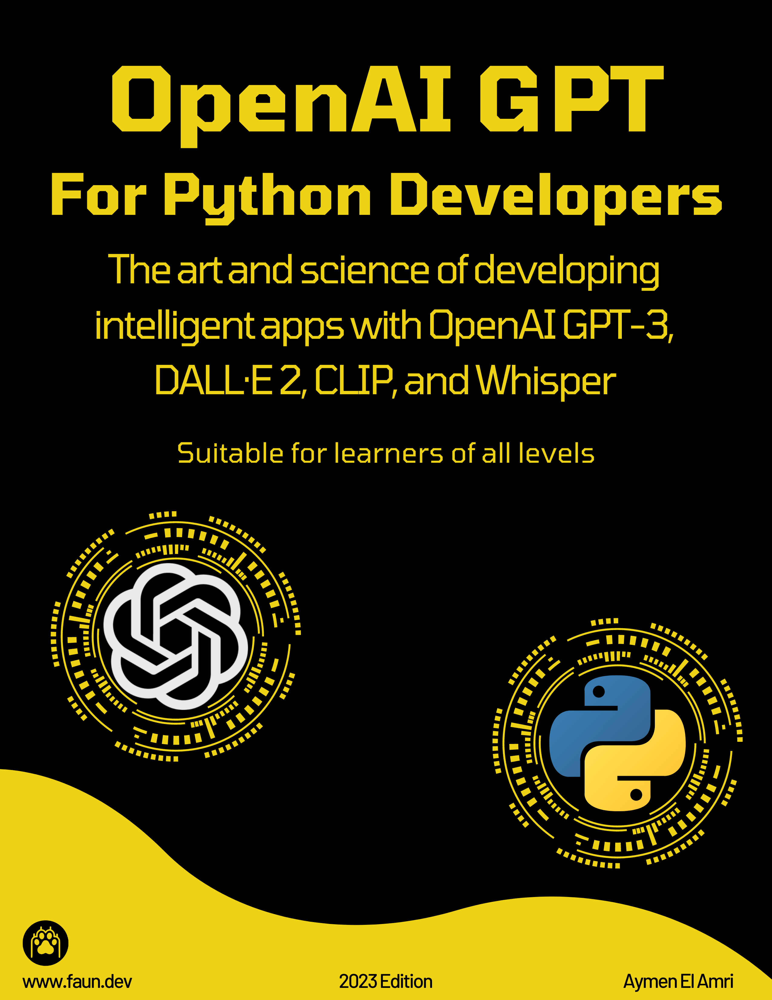

# Brought To You By

## OpenAI GPT for Python Developers

📚 [OpenAI GPT for Python Developers](https://leanpub.com/openaigptforpythondevelopers/) - The art and science of developing intelligent apps with GPT-3, DALL-E, and other OpenAI tools. A comprehensive and example-rich guide suitable for learners of all levels.

## Kala, My AI/ML Weekly Newsletter

❤️ [Kala: AI/ML Weekly Newsletter](https://faun.dev/newsletter/kala) - Curated AI/ML news, tutorials, tools, jobs and more!.

# Follow & Share

# Call for Contributions
👋 We value your contributions, feedback and suggestions. Please feel free to create a pull request or open an issue.

**Note**: Only add resources that are related to ChatGPT and that are useful for developers (e.g: Github projects). 

# Table of Contents

- [Brought To You By](#brought-to-you-by)
  - [OpenAI GPT for Python Developers](#openai-gpt-for-python-developers)
  - [Kala, My AI/ML Weekly Newsletter](#kala-my-aiml-weekly-newsletter)
- [Follow \& Share](#follow--share)
- [Call for Contributions](#call-for-contributions)
- [Table of Contents](#table-of-contents)
- [Awesome ChatGPT](#awesome-chatgpt)
  - [Official Resources](#official-resources)
  - [Developer Libraries, SDKs, and APIs](#developer-libraries-sdks-and-apis)
    - [Python](#python)
    - [JavaScript](#javascript)
    - [Golang](#golang)
    - [Rust](#rust)
    - [TypeScript](#typescript)
    - [Kotlin](#kotlin)
    - [Swift](#swift)
    - [PHP](#php)
    - [Node.js](#nodejs)
    - [Dart](#dart)
    - [Java](#java)
    - [.NET](#net)
  - [Browser Extensions](#browser-extensions)
    - [Chrome](#chrome)
    - [Firefox](#firefox)
  - [Integrations](#integrations)
    - [Terminal](#terminal)
    - [NeoVim](#neovim)
    - [WhatsApp](#whatsapp)
    - [Telegram](#telegram)
    - [Slack](#slack)
    - [Discord](#discord)
    - [VSCode](#vscode)
    - [Google Docs](#google-docs)
    - [JetBrains IDE](#jetbrains-ide)
    - [Wordpress](#wordpress)
    - [Raycast](#raycast)
    - [WeChat](#wechat)
    - [Prompts](#prompts)
  - [AI Assistants](#ai-assistants)
  - [Desktop Apps](#desktop-apps)
  - [Twitter Bots](#twitter-bots)
  - [Research, Papers \& Articles](#research-papers--articles)
  - [Documentations, Tutorials \& Other Resources](#documentations-tutorials--other-resources)
- [Stuff](#stuff)
  - [Star History](#star-history)
  - [Thanks to all the contributors!](#thanks-to-all-the-contributors)

# Awesome ChatGPT

A curated list of awesome ChatGPT resources, libraries, SDKs, APIs, and more.

## Official Resources

- [ChatGPT app](https://chat.openai.com/)
- [ChatGPT overview](https://openai.com/blog/chatgpt/)
- [ChatGTP Discord](https://discord.com/invite/openai)

## Developer Libraries, SDKs, and APIs

### Python

- [ChatGPT](https://github.com/acheong08/ChatGPT): Lightweight package for interacting with ChatGPT's API by OpenAI. Uses reverse engineered official API
- [PyChatGPT](https://github.com/rawandahmad698/PyChatGPT): zap Python client for the unofficial ChatGPT API with auto token regeneration, conversation tracking, proxy support and more.
- [chatgpt-api](https://github.com/taranjeet/chatgpt-api): This repo is unofficial ChatGPT api. It is based on Daniel Gross's WhatsApp GPT
- [chatgpt-wrapper](https://github.com/mmabrouk/chatgpt-wrapper): API for interacting with ChatGPT using Python and from Shell.
- [chatGPT-discord-bot](https://github.com/Zero6992/chatGPT-discord-bot): Integrate ChatGPT into your own discord bot
- [chatgpt-python](https://github.com/labteral/chatgpt-python): Unofficial Python SDK for OpenAI's ChatGPT
- [TextRL](https://github.com/voidful/TextRL): Reinforcement learning in text generation with transformers - Implementation of ChatGPT RLHF (Reinforcement Learning with Human Feedback)
- [stackexplain](https://github.com/shobrook/stackexplain): Explain your error message with ChatGPT
- [gtp3-wordpress-post-generator](https://github.com/nicolaballotta/gtp3-wordpress-post-generator): A simple cli to generate WordPress posts using Gpt3 starting from a topic.
- [emailGPT](https://github.com/lucasmccabe/emailGPT): a quick and easy interface to generate emails with ChatGPT
- [docGPT](https://github.com/cesarhuret/docGPT): ChatGPT directly within Google Docs as an Editor Add-on
- [chatgpt-conversation](https://github.com/platelminto/chatgpt-conversation): Have a conversation with ChatGPT using your voice, and have it talk back.
- [PyGPT](https://github.com/PawanOsman/PyGPT): Python implementation of Unofficial ChatGPT Client
- [chatgpt-telegram-bot](https://github.com/RainEggplant/chatgpt-telegram-bot): A ChatGPT bot for Telegram based on Node.js. Support both browserless and browser-base APIs
- 🇨🇳 [Openaibot](https://github.com/sudoskys/Openaibot): OpenAI Chat Bot For gram
- 🇨🇳 [chatgpt-mirai-qq-bot](https://github.com/lss233/chatgpt-mirai-qq-bot): OpenAI ChatGPT for Mirai QQ Bot
- 🇨🇳 [QChatGPT](https://github.com/RockChinQ/QChatGPT): QQ robot bot developed based on OpenAI ChatGPT
- 🇨🇳 [nonebot-plugin-chatgpt](https://github.com/A-kirami/nonebot-plugin-chatgpt): Smart Conversation Chat plugin for NoneBot2.
- 🇨🇳 [ChineseAiDungeonChatGPT](https://github.com/bupticybee/ChineseAiDungeonChatGPT): AI dungeon using ChatGPT as the storytelling model
- 🇨🇳 [nonebot2](https://github.com/nonebot/nonebot2): Asynchronous multi-platform chatbot framework written in Python

### JavaScript

- [chatgpt-mac](https://github.com/vincelwt/chatgpt-mac): ChatGPT for Mac, living in your menubar.
- [chatgpt-advanced](https://github.com/qunash/chatgpt-advanced): A browser extension that augments your ChatGPT prompts with web results.
- [summarize.site](https://github.com/clmnin/summarize.site): Summarize web pages using OpenAI ChatGPT
- [ChatGPT-ProBot](https://github.com/oceanlvr/ChatGPT-ProBot): A GPTChat based GitHub robot. dialogue/CR/etc..
- [YouTube_Summary_with_ChatGPT](https://github.com/kazuki-sf/YouTube_Summary_with_ChatGPT): YouTube Summary with ChatGPT is a simple Chrome Extension (manifest v3) that allows you to get both YouTube video transcripts and summary of the video with OpenAI's ChatGPT AI technology.
- 🇨🇳 [wechat-bot](https://github.com/wangrongding/wechat-bot): a WeChat bot based on OpenAi ChatGPT + WeChaty that can be used to help you automatically reply to WeChat messages, or manage WeChat groups/friends, detect zombie fans, etc...

### Golang

- [aiac](https://github.com/gofireflyio/aiac): Artificial Intelligence Infrastructure-as-Code Generator.
- [openaigo](https://github.com/otiai10/openaigo): OpenAI (ChatGPT) API Client for Go
- [whatsapp-gpt](https://github.com/danielgross/whatsapp-gpt): WhatsApp bot that uses Golang with a multichat option (chatgpt chatting with chatgpt).
- [beelzebub](https://github.com/mariocandela/beelzebub): A secure honeypot framework low code, extremely easy to configure by yaml 
- [ChatGPT client (unofficial)](https://github.com/abhayptp/go-chatgpt)
- 🇨🇳 [wechatgpt](https://github.com/houko/wechatgpt): wechat chatgpt bot
- 🇨🇳 [chatgpt-dingtalk](https://github.com/eryajf/chatgpt-dingtalk): Add ChatGPT robot to DingTalk group chat

### Rust
- [chatgpt-desktop](https://github.com/sonnylazuardi/chatgpt-desktop): OpenAI ChatGPT desktop app for Mac, Windows, & Linux menubar using Tauri & Rust

### TypeScript
- [chatgpt-raycast](https://github.com/abielzulio/chatgpt-raycast): ChatGPT raycast extension
- [chatgpt-twitter-bot](https://github.com/transitive-bullshit/chatgpt-twitter-bot): Twitter bot powered by OpenAI's ChatGPT. 
- [tweetGPT](https://github.com/yaroslav-n/tweetGPT): TweetGPT is a chrome extension that generates tweets and replies using chatGPT
- [wechat-chatgpt](https://github.com/fuergaosi233/wechat-chatgpt):Use ChatGPT On Wechat via wechaty
- [askai](https://github.com/yudax42/askai): Command Line Interface for OpenAi ChatGPT
- [ChatGPT-Official](https://github.com/PawanOsman/ChatGPT-Official): ChatGPT Client using official OpenAI API
- [chatgpt-io](https://github.com/PawanOsman/chatgpt-io): Unofficial API client for ChatGPT
- [chatgpt-api-wrapper](https://github.com/timkmecl/chatgpt-api-wrapper): Node.js wrapper for connecting to ChatGPT using official OpenAI API
- [ChatGPT-CodeReview](https://github.com/anc95/ChatGPT-CodeReview): A code review bot powered by ChatGPT
- 🇨🇳 [ChatGPT-wechat-bot](https://github.com/AutumnWhj/ChatGPT-wechat-bot): ChatGPT for wechat

### Kotlin
- [chatgpt-android](https://github.com/skydoves/chatgpt-android): ChatGPT Android demonstrates OpenAI's ChatGPT on Android with Stream Chat SDK for Compose.

### Swift
- [new-man](https://github.com/weykon/new-man): New Man is a MacOS native app as a popover view for easy searching and asking.

### PHP
- [ai-commit](https://github.com/guanguans/ai-commit): Automagically generate conventional commit messages with AI.

### Node.js
- [chatgpt-api](https://github.com/transitive-bullshit/chatgpt-api): Node.js client for the unofficial ChatGPT API.
- [node-chatgpt-api](https://github.com/waylaidwanderer/node-chatgpt-api): A client implementation for ChatGPT and Bing. Available as a Node.js module, REST API server, and CLI app.
- [chatgpt-api-wrapper](https://github.com/timkmecl/chatgpt-api-wrapper): Node.js wrapper for connecting to ChatGPT using official OpenAI API
- [Custom-ChatGPT](https://github.com/MohammadAtikurRahman/Custom-ChatGPT): A Custom ChatGPT built using React, Express, and Node.js. The chatbot is powered by OpenAI's text-davinci-003 language model and Custom dataset.

### Dart
- [ChatGPT API Dart](https://github.com/MisterJimson/chatgpt_api_dart): Dart client for the unofficial ChatGPT API
- [OpenAI API Dart](https://github.com/anasfik/openai): Dart/Flutter SDK for ChatGPT and all OpenAI APIs (GPT, Dall-e, Whisper..)
- [openai_client](https://github.com/Azzeccagarbugli/openai_client): An unofficial, platform independent, client for accessing different AI models developed by OpenAI
- [chat_gpt_flutter](https://github.com/hrvojecukman/chat_gpt_flutter): ChatGPT API implemented in Flutter

### Java
- [chatgpt-web-api](https://github.com/swordintent/chatgpt-web-api): A Java Version ChatGPT SDK
- [chatgpt-java](https://github.com/PlexPt/chatgpt-java): ChatGPT Java SDK. Uses reverse engineered official API. 

### .NET
- [ChatGPT.Net](https://github.com/PawanOsman/ChatGPT.Net): Unofficial .Net Client for ChatGPT

## Browser Extensions

### Chrome

- [ChatGPT_Extension](https://github.com/kazuki-sf/ChatGPT_Extension): ChatGPT Extension is a really simple Chrome Extension (manifest v3) that you can access OpenAI's ChatGPT from anywhere on the web.
- [chat-gpt-google-extension](https://github.com/wong2/chat-gpt-google-extension): A browser extension to display ChatGPT response alongside search engine results.
- [ChatGPT-pdf](https://github.com/liady/ChatGPT-pdf): A Chrome extension for downloading your ChatGPT history to PNG, PDF or a sharable link
- [assistant-chat-gpt](https://github.com/idosal/assistant-chat-gpt): A Chrome browser extension that embeds ChatGPT as a hands-free voice assistant
- [sharegpt](https://github.com/domeccleston/sharegpt): Easily share permanent links to ChatGPT conversations with your friends
- [chatgpt-advanced](https://github.com/qunash/chatgpt-advanced): A browser extension that augments your ChatGPT prompts with web results.
- [tweetGPT](https://github.com/yaroslav-n/tweetGPT): TweetGPT is a chrome extension that generates tweets and replies using chatGPT
- [YouTube_Summary_with_ChatGPT](https://github.com/kazuki-sf/YouTube_Summary_with_ChatGPT): YouTube Summary with ChatGPT is a simple Chrome Extension (manifest v3) that allows you to get both YouTube video transcripts and summary of the video with OpenAI's ChatGPT AI technology.
- [ChatGPT for Google](https://github.com/wong2/chatgpt-google-extension): A browser extension that enhance search engines with ChatGPT

### Firefox
- [chat-gpt-google-extension](https://github.com/wong2/chat-gpt-google-extension): A browser extension to display ChatGPT response alongside search engine results.
- [ChatGPT for Google](https://github.com/wong2/chatgpt-google-extension): A browser extension that enhance search engines with ChatGPT

## Integrations

### Terminal
- [ai-cli](https://github.com/abhagsain/ai-cli): Get answers for CLI commands from GPT3 right from your terminal

### NeoVim
- [ChatGPT.nvim](https://github.com/jackMort/ChatGPT.nvim): Neovim plugin for interacting with OpenAI GPT-3 chatbot, providing an easy interface for exploring GPT-3 and NLP.

### WhatsApp
- [whatsapp-gpt](https://github.com/danielgross/whatsapp-gpt): WhatsApp bot that uses Golang with a multichat option (chatgpt chatting with chatgpt).
- [chatgpt-api](https://github.com/taranjeet/chatgpt-api): This repo is unofficial ChatGPT api. It is based on Daniel Gross's WhatsApp GPT

### Telegram
- [chatgpt-telegram-bot-serverless](https://github.com/franalgaba/chatgpt-telegram-bot-serverless): ChatGPT Telegram Bot running in AWS Lambda
- [chatgpt-telegram](https://github.com/m1guelpf/chatgpt-telegram): Run your own GPTChat Telegram bot, with a single command!

### Slack
- [ChatGPTSlackBot](https://github.com/pedrorito/ChatGPTSlackBot): A Slack bot that integrates with OpenAI's ChatGPT to provide answers, written in Python

### Discord
- [ChatGPT3Discord](https://github.com/Kav-K/GPT3Discord): A robust OpenAI integration for discord with ChatGPT queries, conversations, ChatGPT-assisted google search, document indexing, and more!
- [chatgpt-discord](https://github.com/m1guelpf/chatgpt-discord): Run your own GPTChat Discord bot, with a single command!
- [chatGPT-discord-bot](https://github.com/Zero6992/chatGPT-discord-bot): Integrate ChatGPT into your own discord bot

### VSCode
- [chatgpt-vscode](https://github.com/mpociot/chatgpt-vscode): A VSCode extension that allows you to use ChatGPT

### Google Docs
- [docGPT](https://github.com/cesarhuret/docGPT): ChatGPT directly within Google Docs as an Editor Add-on

### JetBrains IDE
- [intellij-chatgpt](https://github.com/LiLittleCat/intellij-chatgpt): A ChatGPT plugin for IntelliJ Platform-Based IDEs

### Wordpress
- [gtp3-wordpress-post-generator](https://github.com/nicolaballotta/gtp3-wordpress-post-generator): A simple cli to generate WordPress posts using Gpt3 starting from a topic.

### Raycast
- [chatgpt-raycast](https://github.com/abielzulio/chatgpt-raycast): ChatGPT raycast extension

### WeChat
- [wechat-chatgpt](https://github.com/fuergaosi233/wechat-chatgpt):Use ChatGPT On Wechat via wechaty
- 🇨🇳 [wechat-bot](https://github.com/wangrongding/wechat-bot): a WeChat bot based on OpenAi ChatGPT + WeChaty that can be used to help you automatically reply to WeChat messages, or manage WeChat groups/friends, detect zombie fans, etc...
- 🇨🇳 [wechatgpt](https://github.com/houko/wechatgpt): wechat chatgpt bot
- 🇨🇳 [ChatGPT-wechat-bot](https://github.com/AutumnWhj/ChatGPT-wechat-bot): ChatGPT for wechat

### Prompts
- [awesome-chatgpt-prompts](https://github.com/f/awesome-chatgpt-prompts): A curated list of ChatGPT prompts
- [showgpt.co](https://showgpt.co/): Curated ChatGPT prompts

## AI Assistants
- [emailGPT](https://github.com/lucasmccabe/emailGPT): a quick and easy interface to generate emails with ChatGPT
- [summarize.site](https://github.com/clmnin/summarize.site): Summarize web pages using OpenAI ChatGPT
- [chatgpt-conversation](https://github.com/platelminto/chatgpt-conversation): Have a conversation with ChatGPT using your voice, and have it talk back.
- [assistant-chat-gpt](https://github.com/idosal/assistant-chat-gpt): A Chrome browser extension that embeds ChatGPT as a hands-free voice assistant

## Web Apps

- [Chat with GPT](https://github.com/cogentapps/chat-with-gpt): ChatGPT web UI made with TypeScript and React.

## Desktop Apps

- [ChatGPT Desktop App](https://github.com/sonnylazuardi/chatgpt-desktop): OpenAI ChatGPT desktop app for Mac, Windows, & Linux menubar using Tauri & Rust
- [ChatGPT for Mac](https://github.com/vincelwt/chatgpt-mac): ChatGPT for Mac, living in your menubar.
- [ChatGPT Desktop Application (Mac, Windows and Linux)](https://github.com/lencx/ChatGPT): ChatGPT Desktop Application (Mac, Windows and Linux)

## Twitter Bots
- [chatgpt-twitter-bot](https://github.com/transitive-bullshit/chatgpt-twitter-bot): Twitter bot powered by OpenAI's ChatGPT.

## Research, Papers & Articles
- [ChatGPT-Comparison-Detection Project](https://github.com/Hello-SimpleAI/chatgpt-comparison-detection): Human ChatGPT Comparison Corpus (HC3), Detectors, and more!
 
## Documentations, Tutorials & Other Resources
- [Awesome ChatGPT Prompts](https://github.com/f/awesome-chatgpt-prompts): This repo includes ChatGPT prompt curation to use ChatGPT better.
- [ResearchGPT](https://github.com/mukulpatnaik/researchgpt): An open-source LLM based research assistant that allows you to have a conversation with a research paper
- [ChatGPT_DAN](https://github.com/0xk1h0/ChatGPT_DAN): ChatGPT DAN, Jailbreaks prompt
- 🇨🇳 [Awesome ChatGPT Prompts (zh)](https://github.com/PlexPt/awesome-chatgpt-prompts-zh): ChatGPT Chinese Tuning Guide

# Stuff

## Star History

## Thanks to all the contributors!

